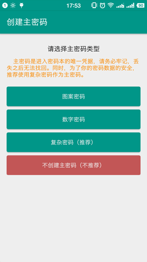
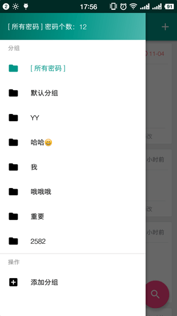
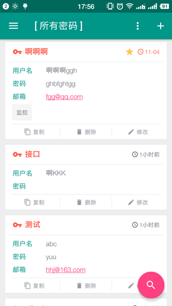
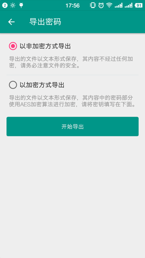
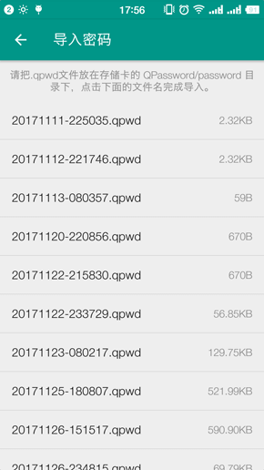
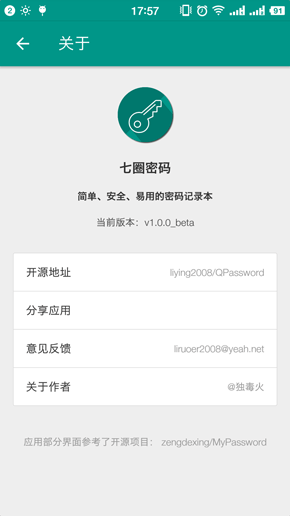

# QPassword (七圈密码) #
---
[](https://github.com/liying2008/QPassword/releases)
[](https://travis-ci.org/liying2008/QPassword)
[](https://codeload.github.com/liying2008/QPassword/zip/master)
[](https://github.com/liying2008/QPassword/blob/master/LICENSE)


> **[Download Latest APK](https://github.com/liying2008/QPassword/releases/download/v1.0.0_beta/qpassword_v1.0.0_beta.apk)**

Compiling Environment
---------------------
- compileSdkVersion 26
- Gradle Version 4.1
- Kotlin Version 1.2.0

### Linux
```shell
./gradlew build
```

### Windows
```shell
gradlew.bat build
```

> **可直接导入 <code>Android Studio 3.0.1</code> 中运行。**

Primary Function
----------------
“**七圈密码**” 是一款用来保存你的各类账号及密码的软件，你只需要记住一个主密码即可轻松管理保存的所有密码，大大减轻了记忆负担。

Others
------
1. 如果用户设置了主密码，则用户所保存的密码都会使用AES加密算法进行加密，加密密钥就是主密码，如果用户选择了不设置主密码，则保存在数据库中的密码数据不会以加密形式存储。
2. 该应用的部分界面参考了：https://github.com/o602075123/MyPassword 。

ScreenShot
----------







Update
------
2017-12-03

Contact Me
---------
Sina Weibo：[@独毒火](http://weibo.com/neuliying)
Email：[liruoer2008@yeah.net](mailto:liruoer2008@yeah.net)

Thanks
----
- [fastjson](https://github.com/alibaba/fastjson)
- [PatternLockView](https://github.com/aritraroy/PatternLockView)
- [guava](https://github.com/google/guava)

License
----

```
Copyright 2017 独毒火

Licensed under the Apache License, Version 2.0 (the "License");
you may not use this file except in compliance with the License.
You may obtain a copy of the License at

   http://www.apache.org/licenses/LICENSE-2.0

Unless required by applicable law or agreed to in writing, software
distributed under the License is distributed on an "AS IS" BASIS,
WITHOUT WARRANTIES OR CONDITIONS OF ANY KIND, either express or implied.
See the License for the specific language governing permissions and
limitations under the License.
```

