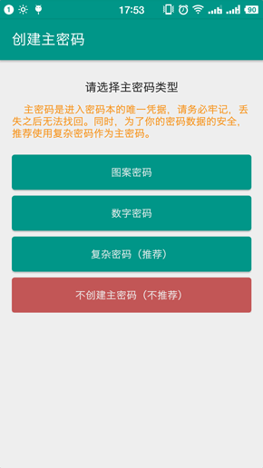
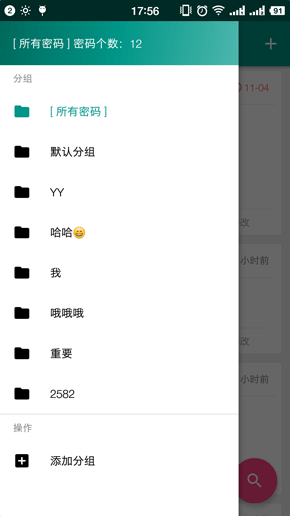
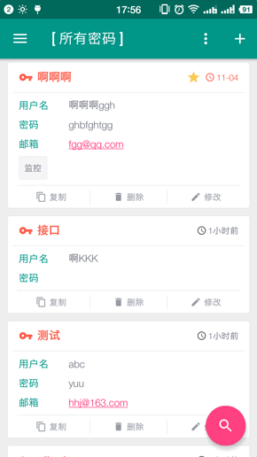
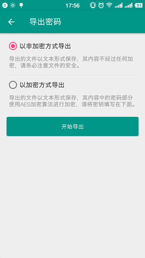
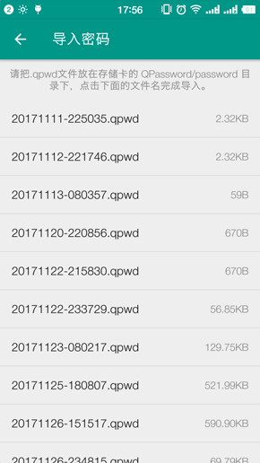
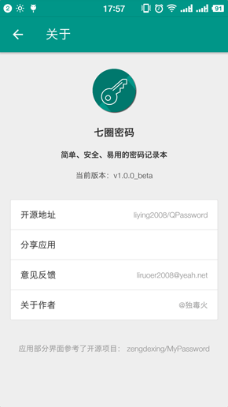

# QPassword (七圈密码)

[](https://github.com/liying2008/QPassword/releases)
[](https://travis-ci.org/liying2008/QPassword)
[](https://codeload.github.com/liying2008/QPassword/zip/master)
[](https://github.com/liying2008/QPassword/blob/master/LICENSE)

## QPassword 已交由 [yingyuelite/QPassword](https://github.com/yingyuelite/QPassword) 继续维护！

> **重要提醒**：  
> 本仓库为 QPassword v1版本，目前已**不再维护**。v2版本的 QPassword 请到这个仓库（[yingyuelite/QPassword](https://github.com/yingyuelite/QPassword)）下载。

> **数据迁移方法**：  
> 首先打开 v1版本的应用，点击右上角菜单，选择“导出到存储卡”，选择“以非加密方式导出”，点击“开始导出”即可将密码数据导出到存储卡。  
> 然后使用新版本（v2版本）的微信小程序或者应用，点击右上角“...”菜单，选择“导入密码”，点击“从v1版本导入密码”，选择刚刚导出的密码文件（一般在 `QPassword/password` 目录下），导入。  
> 待确认导入成功之后，将刚才导出到存储卡的密码文件在文件管理器中删除，避免数据泄露。

## Compiling Environment

- compileSdkVersion 28
- targetSdkVersion 28
- Gradle Version 4.6
- Kotlin Version 1.2.71

### Linux

```shell
./gradlew assembleDebug
```

### Windows

```shell
gradlew assembleDebug
```

> **项目可直接导入 <code>Android Studio 3.2</code> 中运行。**

## Primary Function

“**七圈密码**” 是一款用来保存你的各类账号及密码的软件，你只需要记住一个主密码即可轻松管理保存的所有密码，大大减轻了记忆负担。

### Others

1. 如果用户设置了主密码，则用户所保存的密码都会使用AES加密算法进行加密，加密密钥根据主密码生成；如果用户选择不设置主密码，则保存在数据库中的密码数据将会以明文形式存储；
2. 该应用不联网，用户存储的所有密码均保存在本地；
3. 该应用的部分界面参考了：https://github.com/o602075123/MyPassword 。

## ScreenShot








## Update

2018-10-16

## ChangeLog

[点击查看更新日志](CHANGELOG.md)

## Contact Me

Email：[liruoer2008@yeah.net](mailto:liruoer2008@yeah.net)  

## Thanks

- [fastjson](https://github.com/alibaba/fastjson)
- [PatternLockView](https://github.com/aritraroy/PatternLockView)
- [guava](https://github.com/google/guava)

## License

```
Copyright 2017-2018 独毒火

Licensed under the Apache License, Version 2.0 (the "License");
you may not use this file except in compliance with the License.
You may obtain a copy of the License at

   http://www.apache.org/licenses/LICENSE-2.0

Unless required by applicable law or agreed to in writing, software
distributed under the License is distributed on an "AS IS" BASIS,
WITHOUT WARRANTIES OR CONDITIONS OF ANY KIND, either express or implied.
See the License for the specific language governing permissions and
limitations under the License.
```

